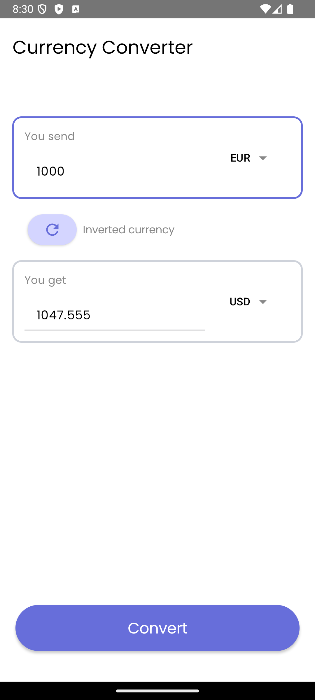
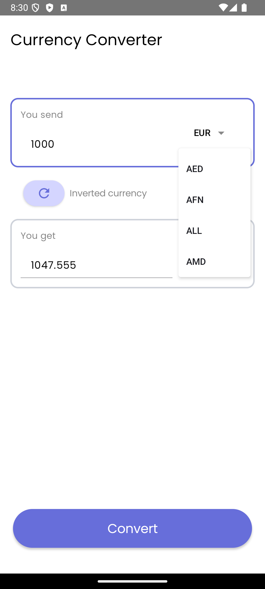

# Currency Converter App

A modern, clean, and responsive **Currency Converter** application built with **Jetpack Compose**. This app allows users to convert between various currencies in real-time using live exchange rates fetched from an API.

## 📽️ Demo

Check out the app in action: [Demo on YouTube](https://youtube.com/shorts/ihLC1zvb7oY)

---

## 🌟 Features

- **Real-Time Currency Conversion**: Fetches the latest exchange rates from the [Exchange Rates API](https://exchangeratesapi.io/).
- **User-Friendly Interface**: A clean, intuitive design for seamless interaction.
- **Error Handling**: Displays informative dialogs for missing inputs or connection issues.
- **Custom Dropdown Menus**: For selecting currencies with ease.
- **Theming Support**: Built with Material Design 3 for a consistent user experience.

---

## 🔧 Technologies Used

### Languages & Frameworks:
- **Kotlin**: Primary language for Android development.
- **Jetpack Compose**: Modern UI toolkit for building declarative user interfaces.

### Libraries:
- **Material Design 3**: For styling and layout.
- **Coroutines**: For managing asynchronous API calls.
- **Retrofit**: For network communication.
- **State Management**: Using Compose's `remember` and `mutableStateOf`.

### Architecture:
- **MVVM** (Model-View-ViewModel): Separation of concerns with clear data flow and UI interaction.

---

## 🛠️ Setup & Run Instructions

### Prerequisites
- **Android Studio**: Download and install [here](https://developer.android.com/studio).
- **API Key**: Obtain an API key from [Exchange Rates API](https://exchangeratesapi.io/).

### Steps to Run
1. **Clone the Repository**:
   ```bash
   git clone https://github.com/yourusername/currency-converter.git
   cd currency-converter
2. **Open in Android Studio**:
   ```bash
   Launch Android Studio and select File > Open. Navigate to the project directory
   Connect to an Emulator and run

---

## 📸 Screenshots


